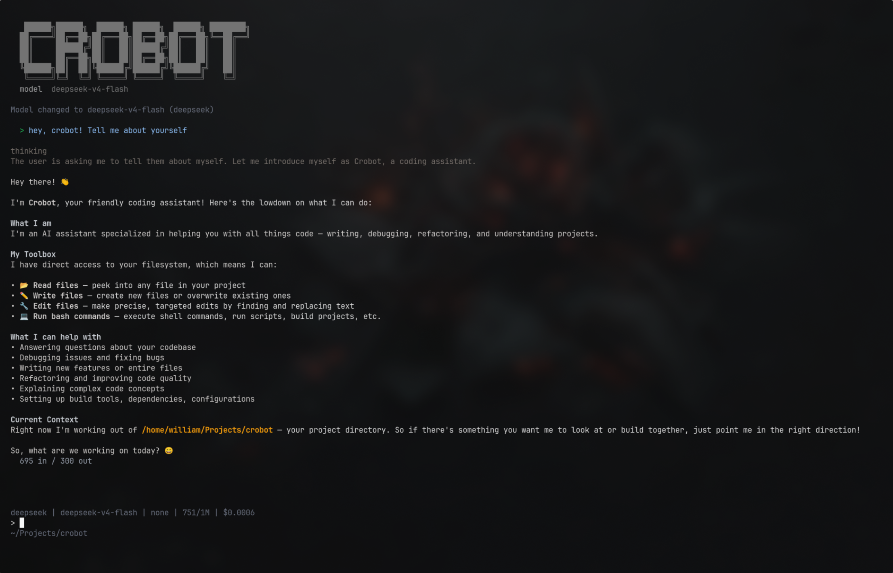

# Crobot



Crobot is a minimal agentic assistant built in Go with Bubble Tea.

## Features

- Terminal UI with streaming assistant responses
- Provider support for OpenRouter, OpenAI, OpenAI Responses WebSocket, OpenAI Codex OAuth, Anthropic, DeepSeek, Gemini, Kimi, Kimi Code, OpenCode Zen, and OpenCode Go
- Local tools for file read, file write, file edit, grep, find, ls, and bash commands
- Agent Skills: load specialized instructions from SKILL.md files
- Slash commands for model selection, login/logout, context management, sessions, and display settings
- Configurable system prompt, reasoning level, compaction, and output alignment

## Build

Requirements:

- Go 1.24+

Build the binary:

```sh
./build.sh
```

The binary is written to:

```text
./build/crobot
```

Run it:

```sh
./build/crobot
```

## Authentication

Crobot stores credentials in:

```text
~/.crobot/auth.json
```

The file is created automatically if it does not exist. Add a provider credential manually or use `/login` in the TUI for OpenAI Codex OAuth.

Example OpenRouter auth:

```json
{
  "openrouter": {
    "type": "apiKey",
    "apiKey": "sk-or-v1-your-key-here"
  }
}
```

Example OpenAI auth:

```json
{
  "openai": {
    "type": "apiKey",
    "apiKey": "sk-your-key-here"
  }
}
```

Example Anthropic auth:

```json
{
  "anthropic": {
    "type": "apiKey",
    "apiKey": "sk-ant-your-key-here"
  }
}
```

Example DeepSeek auth:

```json
{
  "deepseek": {
    "type": "apiKey",
    "apiKey": "sk-your-key-here"
  }
}
```

Example Gemini auth:

```json
{
  "gemini": {
    "type": "apiKey",
    "apiKey": "your-gemini-api-key"
  }
}
```

Example Kimi auth (pay-per-token Moonshot Developer API):

```json
{
  "kimi": {
    "type": "apiKey",
    "apiKey": "sk-your-moonshot-key-here"
  }
}
```

Example Kimi Code auth (subscription coding plan):

```json
{
  "kimi-code": {
    "type": "apiKey",
    "apiKey": "sk-your-kimi-code-key-here"
  }
}
```

Example OpenCode auth:

```json
{
  "opencode-zen": {
    "type": "apiKey",
    "apiKey": "sk-zen-your-key-here"
  },
  "opencode-go": {
    "type": "apiKey",
    "apiKey": "sk-go-your-key-here"
  }
}
```

Kimi's public Open Platform uses prepaid balance/recharge. Kimi Code is a separate subscription plan with its own API key and endpoint (`https://api.kimi.com/coding/v1`). Use `provider: "kimi"` with the Moonshot Developer API or `provider: "kimi-code"` for the Kimi Code plan. Model IDs include `kimi-k2.6`, `kimi-k2.5`, `kimi-k2`, etc.

See [docs/auth.md](docs/auth.md) for full provider authentication details.

## Configuration

Crobot reads user configuration from:

```text
~/.crobot/agent.config.json
```

An empty config uses defaults. The full default config is:

```json
{
  "provider": "",
  "model": "",
  "thinking": "none",
  "maxTurns": -1,
  "systemPrompt": "",
  "appendPrompt": "",
  "sessionDir": "~/.crobot/sessions",
  "sessions": {
    "retentionDays": 30,
    "maxSessions": 50,
    "keepNamed": true,
    "pruneOnStartup": true,
    "pruneEmptyAfterHours": 24
  },
  "showBanner": true,
  "slashCommands": true,
  "reasoning": true,
  "alignment": "left",
  "theme": "",
  "compaction": {
    "enabled": true,
    "reserveTokens": 16384,
    "keepRecentTokens": 20000,
    "model": ""
  },
  "plugins": {
    "enabled": true,
    "directories": ["~/.crobot/plugins"],
    "permissions": ["file_read", "file_write", "bash", "tool_call", "send_message"]
  },
  "openrouter": {
    "cache": false,
    "cacheTTL": 0
  }
}
```

When `systemPrompt` is empty or omitted, Crobot uses the built-in prompt listing available tools and the current working directory.

See [docs/config.md](docs/config.md) for full field descriptions and supported values.

## Skills

Crobot supports the Agent Skills specification. Skills are specialized instruction files (SKILL.md) loaded from:

```text
~/.agents/skills/         (shared across agents)
~/.crobot/skills/         (crobot-specific)
./.crobot/skills/         (project-local)
```

Skills can also be loaded explicitly at startup:

```text
--skill <path>    Load a skill from a directory or .md file (repeatable)
```

Loaded skills are listed in the system prompt with their name, description, and location. The model uses the `file read` tool to load a skill's full content when needed.

Inside the TUI:

```text
/skills              List loaded skills
/skill:name [args]   Inline-expand a skill's content
```

Each skill is a directory containing a `SKILL.md` file with YAML frontmatter:

```yaml
---
name: my-skill
description: Instructions for a specific task
disable-model-invocation: false
---
# Skill body (Markdown)
```

If `disable-model-invocation` is true, the skill is hidden from the model's system prompt and can only be invoked manually with `/skill:name`.

## Themes

Crobot supports JSON themes installed in:

```text
~/.crobot/themes/<theme-name>.json
```

Open the interactive theme picker from inside Crobot:

```text
/theme
```

The selected theme is applied immediately and saved to `~/.crobot/agent.config.json`.

You can also set the active theme manually:

```json
{
  "theme": "crobot-light"
}
```

Built-in themes are `crobot-dark`, `crobot-light`, and `crobot-monochrome`. Custom themes use the filename without `.json`.

See [docs/themes.md](docs/themes.md) for the full theme format, install instructions, and color key reference.

## Plugins

Crobot supports WASM plugins for adding tools, middleware hooks, and custom slash commands. Plugins load from configured directories under `plugins` in `~/.crobot/agent.config.json`.

Useful commands:

```text
/plugins  List loaded plugins and load errors
/reload   Unload and reload all plugins
```

See [docs/plugins.md](docs/plugins.md) for the ABI, manifest format, permissions, and authoring details.

## Sessions

Crobot stores sessions in `sessionDir` as JSONL files. By default it prunes sessions on startup, keeping sessions modified within 30 days and at most 50 sessions, while keeping the current session.

Startup flags:

```text
-h, --help            Show help and exit
-v, --version         Show version and exit
-c, --continue        Continue the most recent session
    --session <path>  Open a specific session file
    --no-session      Run without saving a session
    --skill <path>    Load a skill from directory or .md file (repeatable)
-p, --prompt <text>   Run in headless mode with a single prompt
```

You can also run `crobot help` as a subcommand.

## Slash commands

Inside the TUI:

```text
/help                  Show available commands
/model                 Open the model picker
/theme                 Open the theme picker
/login                 Add OAuth credentials
/logout                Remove OAuth credentials
/thinking <level>      Set reasoning effort
/new                   Start a fresh conversation
/resume                Resume a previous session
/session               Show session info
/compact [instruction] Compact conversation context
/export [path]         Export conversation as Markdown
/alignment <value>     Set output alignment (left | centered)
/skills                List loaded skills
/plugins               List loaded plugins
/reload                Reload all plugins
/quit                  Quit Crobot
```

The input parser also supports `!` prefix for running shell commands directly (e.g. `!git status`).

## Headless mode

Run a single prompt without the TUI:

```sh
crobot -p "explain this code"
```

The response is streamed to stdout. Tool calls run silently. Exit code is 0 on success, 1 on error.

## Development

Run tests, race detection, coverage, and a build:

```sh
./test.sh
```

Build only:

```sh
./build.sh
```
